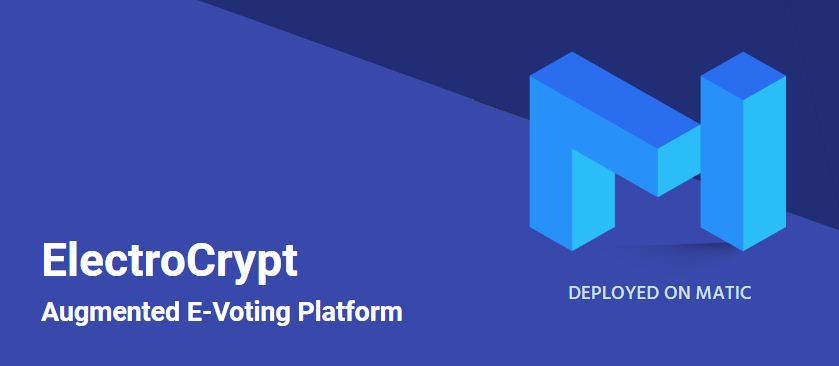
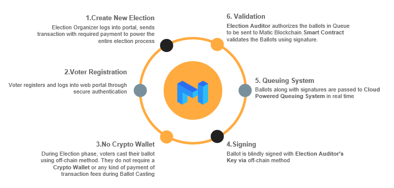

 

# ElectroCrypt - The Augmented E-Voting Platform

(_solution designed for the DecentralHacks+HackerEarth hackathon_)

## Overview

ElectroCrypt is a voting platform that augments prevalent blockchain powered _e-voting_ systems with the integration of cloud technology, in order to provide strong security, flexible ballot casting, attack mitigation, and public auditing for transparency.

ElectroCrypt's two main objectives are:

- To achieve **public acceptance** regardless of the user's technical blockchain knowledge
- To empower any kind of public with **blockchain-driven technology** to promote democracy

## Architecture

ElectroCrypt leverages the advantages of [Matic Network](https://matic.network), which is a blockchain decentralized application platform that provides hybrid _proof-of-stake_ and _plasma-enabled_ sidechains.

The system creates a bridge between decentralized **Matic Blockchain Network** with centralized database and queuing systems powered by [Google Firebase](https://firebase.google.com/) services.

## How it works

 

## Key benefits

- Off-chain transactions
- Walletless ballot cast
- Secure cryptographic signatures
- Flexibility for everyone

## Tech stack

|                                                 |                                                      |                                                    |                                                       |
| ----------------------------------------------- | ---------------------------------------------------- | -------------------------------------------------- | ----------------------------------------------------- |
|  |     |  |         |
|  |  |  |  |
